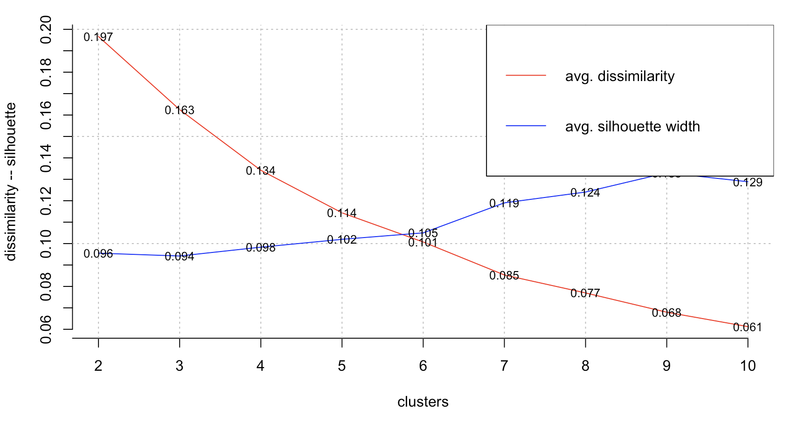

```{r setup, include=FALSE}
library(formatR)
knitr::opts_chunk$set(echo = TRUE, warning = FALSE, message = FALSE, fig.width = 10, fig.height = 7, fig.path = "plots/", tidy = TRUE, tidy.opts = list(width.cutoff = 80))
```


## Introduction

This analysis provides a comprehensive look into international tourist expenditures, specifically focusing on the spending per departure abroad. The goal is to move beyond simple statistics and use clustering techniques to uncover meaningful groups of countries with similar spending habits and income levels. This information is a valuable asset for any business in the tourism sector, from airlines to hotel chains and travel agencies, enabling more strategic decisions in marketing, product development, and resource allocation.

## Methodology and Optimal Clusters

To begin my journey, I first prepared the data by cleaning, handling missing values, and standardizing the key variables: the five-year average expenditure per departure abroad and the country's income rate. This standardization (creating Z-scores) is crucial as it ensures that both variables contribute equally to the clustering process.

Next, I determined the optimal number of clusters for my analysis. I used several primary methods for this: K-means, PAM, CLARA and Hierarchical Clustering.

## 1. Loading Libraries and Data

```{r}
library(ggplot2)
library(readxl)
library(flexclust)
library(factoextra)
library(cluster)
library(ClusterR)
library(dendextend)
library(ggrepel)
library(RColorBrewer)
library(dplyr)

expenditures <- read_excel(path = "./data/INT_XPND.xlsx", sheet = "Data", col_names = TRUE)
departures <- read_excel(path = "./data/INT_DPRT.xlsx", sheet = "Data", col_names = TRUE)

glimpse(expenditures)
glimpse(departures)
```

## 2. Preparing the data
```{r preparing}
# Converting columns 1:4 to factors
expenditures[1:4] <- lapply(expenditures[1:4], as.factor)
departures[1:4] <- lapply(departures[1:4], as.factor)

# Calculating spending per departure across years and 5 years average
exp_per_departure <- expenditures[, 5:29] / departures[, 5:29]
exp_per_departure$fiveyears_average <- rowMeans(exp_per_departure[, c("2015", "2016", "2017", "2018", "2019")],
                                                  na.rm = TRUE)
EPD_Selected <- cbind(departures[, 1:4], "fiveyears_average" = exp_per_departure$fiveyears_average)
EPD_Selected <- EPD_Selected[order(EPD_Selected$`Country Name`), ]

# 3. Cleaning and processing the data
EPD_Selected <- na.omit(EPD_Selected)
EPD_Selected <- EPD_Selected[!grepl("Venezuela, RB", EPD_Selected$`Country Name`), ]
EPD_Selected$Income_Rate <- ifelse(EPD_Selected$IncomeGroup == "Low income", 1,
                                   ifelse(EPD_Selected$IncomeGroup == "Lower middle income", 2,
                                          ifelse(EPD_Selected$IncomeGroup == "Upper middle income", 3, 4)))

# Standardizing the data
EPD_z <- as.data.frame(lapply(EPD_Selected[, c("fiveyears_average", "Income_Rate")], scale))
EPD_Selected$z_score <- EPD_z$fiveyears_average
EPD_Selected$z_score_income <- EPD_z$Income_Rate

# Creating data frames for labels once
top_5_data <- EPD_Selected[order(EPD_Selected$fiveyears_average, decreasing = TRUE)[1:5], ]
top_5_data$index <- match(top_5_data$`Country Name`, EPD_Selected$`Country Name`)

low_5_data <- EPD_Selected[order(EPD_Selected$fiveyears_average, decreasing = FALSE)[1:5], ]
low_5_data$index <- match(low_5_data$`Country Name`, EPD_Selected$`Country Name`)
glimpse(top_5_data)
glimpse(low_5_data)
```

## 3. K-means Clustering

Four clusters were chosen because the decrease in the optimization metric significantly slows after 
k = 4, indicating that additional clusters offer diminishing returns and minimal improvement. This point represents the "elbow" in the curve, suggesting an optimal balance between model simplicity and explanatory power.
```{r kmeans}
opt <- Optimal_Clusters_KMeans(EPD_z, max_clusters = 10, plot_clusters = TRUE)

EPD_clusters <- kmeans(EPD_z$fiveyears_average, centers = 4)
EPD_Selected$cluster <- EPD_clusters$cluster

ggplot(EPD_Selected, aes(x = seq_along(z_score), y = z_score, color = factor(cluster))) +
  geom_point(size = 3, alpha = 0.6) +
  scale_color_brewer(palette = "Set1") +
  geom_text_repel(data = top_5_data, aes(x = index, y = z_score, label = `Country Name`), size = 3, box.padding = 0.5, point.padding = 0.5, segment.color = "grey50", segment.size = 0.2, min.segment.length = 0, max.overlaps = 20, color = "black") +
  geom_text_repel(data = low_5_data, aes(x = index, y = z_score, label = `Country Name`), size = 3, box.padding = 0.5, point.padding = 0.5, segment.color = "grey50", segment.size = 0.2, min.segment.length = 0, max.overlaps = 20, color = "darkred") +
  theme_minimal() +
  labs(title = "K-means Clustering", x = "Index", y = "Z-Score (fiveyears_average)", color = "Cluster") +
  theme(plot.title = element_text(hjust = 0.5, face = "bold"))
```

## 4. PAM Clustering

```{r}
opt_md2 <- Optimal_Clusters_Medoids(EPD_z, max_clusters = 10, distance_metric = "euclidean", plot_clusters = FALSE, criterion = "silhouette")
```

For PAM algorithm 6 clusters were chosen because the elbow method indicated a flattening of the within-cluster sum of squares around this point, suggesting a balance between cluster quality and interpretability, while the increasing silhouette width after 6 clusters indicated potential overfitting for a dataset with only 2 dimensions.

```{r pam}
EPD_clusters_PAM <- pam(EPD_z, k = 6)
EPD_Selected$cluster_PAM <- factor(EPD_clusters_PAM$clustering)

ggplot(EPD_Selected, aes(x = z_score, y = z_score_income, color = cluster_PAM)) +
  geom_point(size = 3, alpha = 0.6) +
  scale_color_brewer(palette = "Set1") +
  geom_text_repel(data = top_5_data, aes(x = z_score, y = z_score_income, label = `Country Name`), size = 3, box.padding = 0.5, segment.color = "grey50", min.segment.length = 0, max.overlaps = 20, color = "black") +
  geom_text_repel(data = low_5_data, aes(x = z_score, y = z_score_income, label = `Country Name`), size = 3, box.padding = 0.5, segment.color = "grey50", min.segment.length = 0, max.overlaps = 20, color = "darkred") +
  theme_minimal() +
  labs(title = "PAM Clustering", x = "Z-Score (fiveyears_average)", y = "Z-Score (Income_Rate)", color = "Cluster") +
  theme(plot.title = element_text(hjust = 0.5, face = "bold"))
```

## 5. CLARA Clustering

For CLARA algorithm 4 clusters were chosen because the elbow method results from my K-means analysis showed a noticeable flattening of the within-cluster sum of squares (WCSS) around 4 clusters, indicating a good balance between cluster separation and data structure simplicity. Additionally, this number aligns with the potential natural groupings in my dataset, such as the four income categories (low, lower-middle, upper-middle, high), making it a practically interpretable choice for the CLARA clustering of the standardized EPD_z data.

```{r clara}
EPD_clara <- eclust(EPD_z, "clara", k = 4, stand = TRUE, graph = FALSE)
EPD_Selected$cluster_clara <- factor(EPD_clara$cluster)

hull_data <- EPD_Selected %>%
  group_by(cluster_clara) %>%
  slice(chull(z_score, z_score_income)) %>%
  ungroup()

ggplot(EPD_Selected, aes(x = z_score, y = z_score_income, color = cluster_clara)) +
  geom_polygon(data = hull_data, aes(fill = cluster_clara), alpha = 0.2, show.legend = FALSE) +
  geom_point(size = 3, alpha = 0.6) +
  scale_color_brewer(palette = "Set1") +
  scale_fill_brewer(palette = "Set1") +
  geom_text_repel(data = top_5_data, aes(x = z_score, y = z_score_income, label = `Country Name`), size = 3, box.padding = 0.5, segment.color = "grey50", min.segment.length = 0, max.overlaps = 20, color = "black") +
  geom_text_repel(data = low_5_data, aes(x = z_score, y = z_score_income, label = `Country Name`), size = 3, box.padding = 0.5, segment.color = "grey50", min.segment.length = 0, max.overlaps = 20, color = "darkred") +
  theme_minimal() +
  labs(title = "CLARA Clustering with Boundaries", x = "Z-Score (fiveyears_average)", y = "Z-Score (Income_Rate)", color = "Cluster") +
  theme(plot.title = element_text(hjust = 0.5, face = "bold"))
```

## 6. Hierarchical Clustering

I chose the complete linkage method for my hierarchical clustering because it effectively handles clusters of varying shapes and sizes by using the maximum distance between observations in different clusters, providing a robust structure for my dataset of standardized EPD_z (tourism expenditure and income rate). The resulting dendrogram, visualized with plot(hc1, cex = 0.8, hang = -1), allows me to identify natural groupings, potentially confirming the 4-cluster solution from K-means and CLARA or suggesting a different number based on the tree’s cutting height.

```{r hclust}
rownames(EPD_z) <- EPD_Selected$`Country Name`
d <- dist(EPD_z, method = "euclidean")

# hclust dendrogram
hc1 <- hclust(d, method = "complete")
plot(hc1, cex = 0.8, hang = -1, main = "Cluster Dendrogram (hclust)")
```

```{r diana}
# diana dendrogram
Divisive <- diana(EPD_z)
pltree(Divisive, cex = 0.6, hang = -1, main = "Dendrogram - DIANA")
```

I included the tanglegram comparison to visualize the differences and similarities between complete linkage and single linkage hierarchical clustering methods on my standardized EPD_z dataset (tourism expenditure and income rate), using Euclidean distance.

```{r tanglegram}
# Tanglegram comparison
res.dist <- dist(EPD_z, method = "euclidean")
hc1_comp <- hclust(res.dist, method = "complete")
hc2_comp <- hclust(res.dist, method = "single")
dend1 <- as.dendrogram(hc1_comp)
dend2 <- as.dendrogram(hc2_comp)
cluster_colors <- brewer.pal(4, "Set1")
dend1 <- dend1 %>% set("labels_cex", 0.7) %>% color_branches(k = 4, col = cluster_colors)
dend2 <- dend2 %>% set("labels_cex", 0.7) %>% color_branches(k = 4, col = cluster_colors)
dendlist <- dendlist(dend1, dend2) %>% untangle(method = "step1")

tanglegram(
  dendlist[[1]], 
  dendlist[[2]],
  main_left = "Complete Linkage", 
  main_right = "Single Linkage",
  lab.cex = 0.7,
  lwd = 1.5,
  columns_width = c(5, 3, 5),
  margin_bottom = 0.5,
  highlight_distinct_edges = FALSE,
  common_subtrees_color_lines = TRUE
)
```

This Tanglegram visually compares the results of two different hierarchical clustering methods, Complete Linkage (left) and Single Linkage (right), applied to the same dataset of countries. The primary takeaway is that the choice of linkage method has a significant impact on the resulting cluster structure for this dataset. The high degree of "tangle" (crossing lines) in the center indicates a substantial disagreement between the two methods.

## 7. Algorithm selection

Based on the results, I chose CLARA because it provides a robust and scalable clustering solution with 4 clusters, aligning with the elbow method’s indication of a natural data structure and the four income categories, which offers practical interpretability for tourism sector applications.

## 8. Final clusters

``` {r}
cluster_names <- c(
  "Emerging & Low-Spending Markets",
  "Developing & Mid-to-High Spending Markets",
  "High-Value & Global Spenders",
  "Established & Mid-Range Spenders"
)

for (i in 1:4) {
  cat(paste("\n--- Cluster", i, ":", cluster_names[i], "---\n"))

  cluster_content <- EPD_Selected %>%
    filter(cluster_clara == i) %>%
    select(`Country Name`, fiveyears_average, IncomeGroup)
  
  print(cluster_content)
}
```

## 9. Conclusion

The clustering analysis of global tourism expenditures reveals distinct, actionable insights into the interplay between national income, geography, and consumer behavior. Four primary market segments have been identified, each with unique characteristics valuable for strategic decision-making in the tourism sector.

**Emerging economies can still be high spenders per trip**
Despite being in Cluster 1 with lower income classifications, countries like Romania, Ukraine, and Mexico exhibit relatively high average spending per departure. This suggests that in some emerging markets, international travel is less frequent but more costly per trip—potentially due to longer distances or more significant visa/travel costs.

**Geographic isolation inflates spending per trip**
Remote nations such as Fiji, New Caledonia, and Vanuatu show elevated spending despite modest income levels. Their geographic remoteness likely drives up flight and transportation costs, increasing average expenditures per departure.

**Upper middle-income countries are increasingly active travelers**
Countries like Iran, Kazakhstan, and Argentina in Cluster 2 demonstrate travel spending levels comparable to high-income nations. These patterns point to a growing middle class and increased international mobility across parts of Latin America, Eastern Europe, and Central Asia.

**High-income status doesn't always mean top-tier travel spending**
Not all wealthy countries fall into the top-spending Cluster 3. Instead, nations like Ireland, Portugal, Hong Kong SAR, and Poland are grouped in Cluster 4, indicating a more moderate and possibly value-conscious travel behavior, despite their economic capacity. This could reflect closer proximity to affordable destinations or strong regional travel infrastructure (e.g., low-cost carriers in Europe).

**Small wealthy nations dominate top-spending behavior**
Cluster 3 is populated by affluent, often smaller nations like Luxembourg, Singapore, and Denmark, where high disposable income and frequent travel—often to faraway or premium destinations—lead to consistently high per-departure spending.

**Low-income countries are still visible in international travel**
Even low-income countries like Sierra Leone, Togo, and Zimbabwe appear in Cluster 1. While their total travel volume may be low, their average per-trip spending remains measurable, likely due to infrequent but essential travel (e.g., migration, family visits, or study abroad).

**Travel costs vary significantly by region**
Countries like Australia, Chile, and New Zealand show high per-departure costs not necessarily due to luxury but because of geographic isolation. Airfare and logistical costs heavily influence travel spending in such cases, even when average daily budgets are moderate.