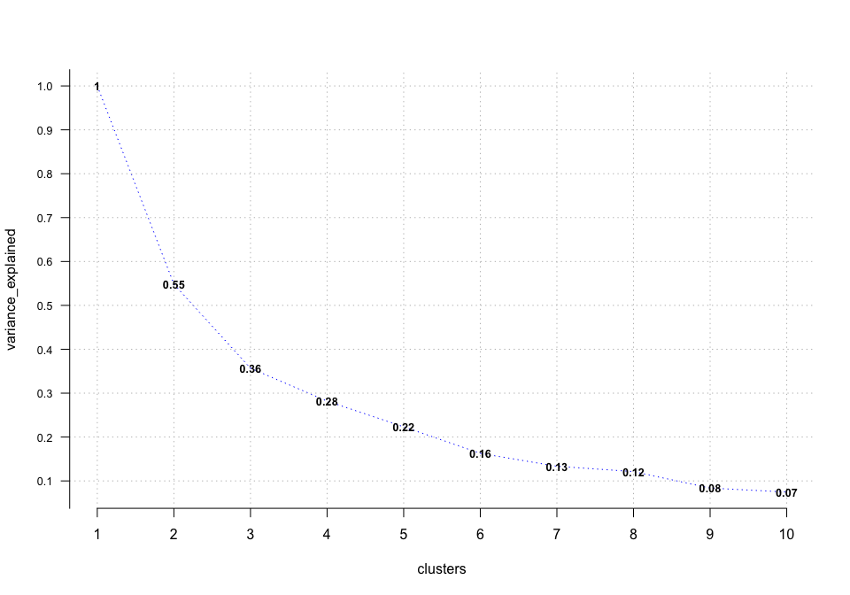
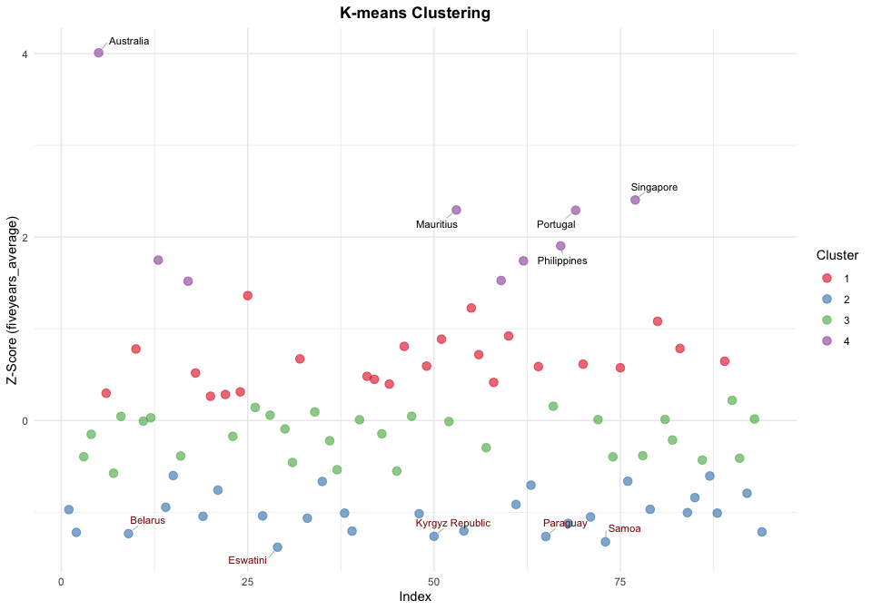
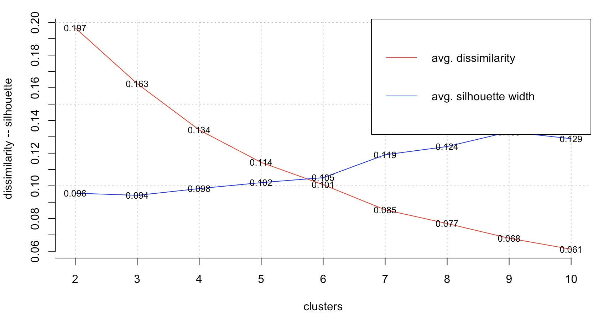
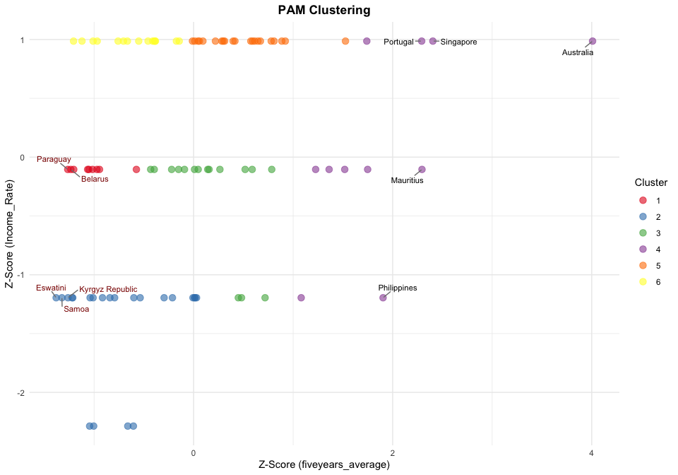
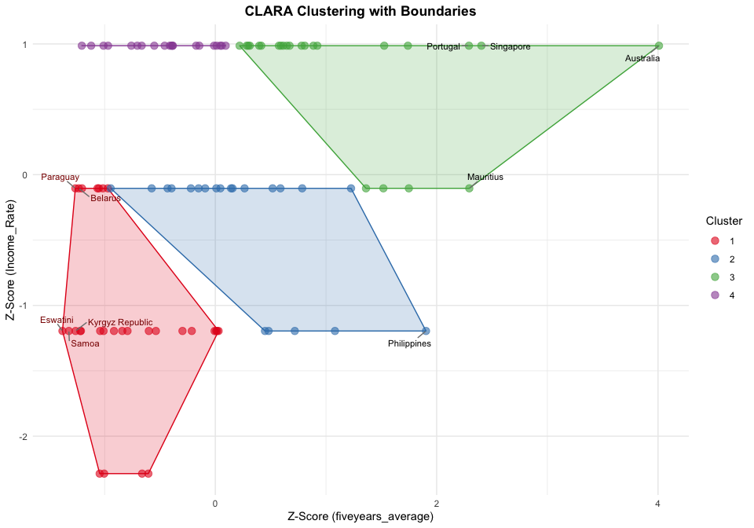
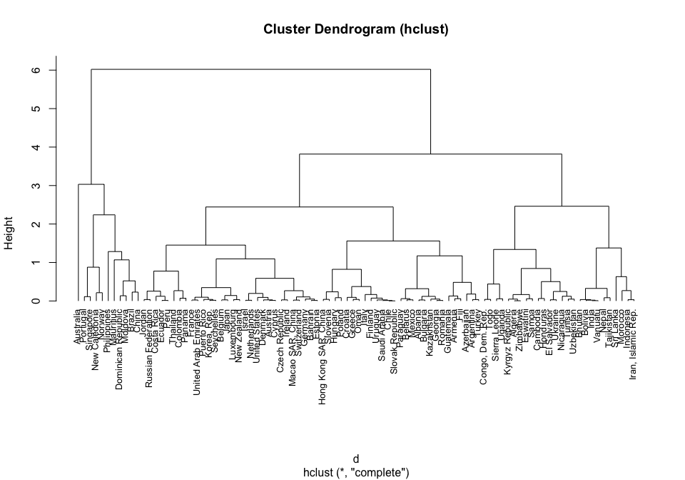
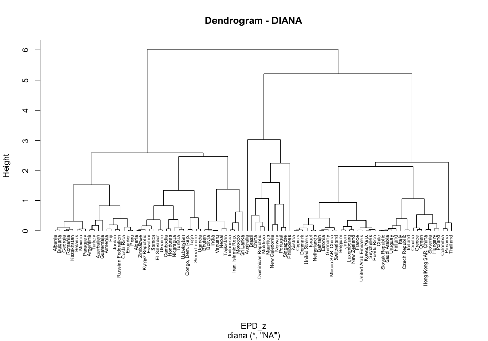
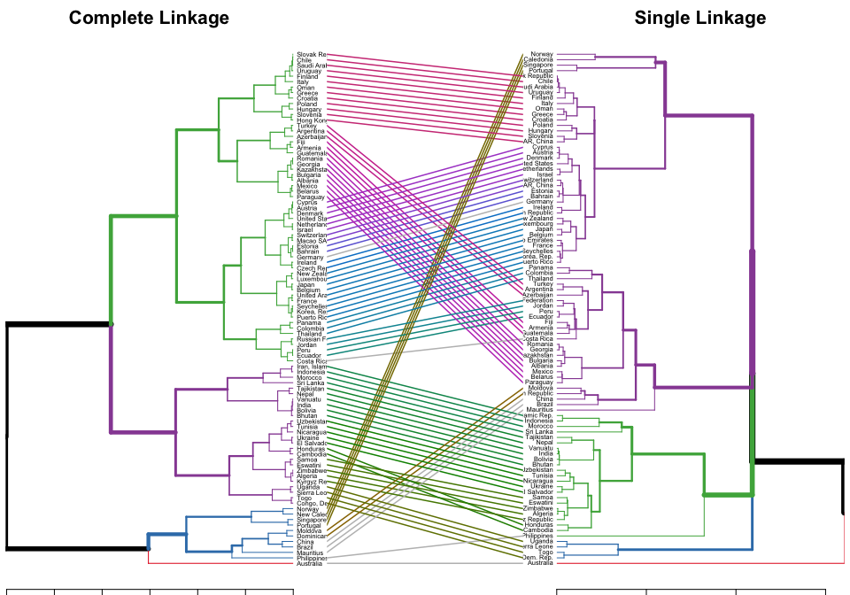

## Introduction

This analysis provides a comprehensive look into international tourist
expenditures, specifically focusing on the spending per departure
abroad. The goal is to move beyond simple statistics and use clustering
techniques to uncover meaningful groups of countries with similar
spending habits and income levels. This information is a valuable asset
for any business in the tourism sector, from airlines to hotel chains
and travel agencies, enabling more strategic decisions in marketing,
product development, and resource allocation.

## Methodology and Optimal Clusters

To begin my journey, I first prepared the data by cleaning, handling
missing values, and standardizing the key variables: the five-year
average expenditure per departure abroad and the country’s income rate.
This standardization (creating Z-scores) is crucial as it ensures that
both variables contribute equally to the clustering process.

Next, I determined the optimal number of clusters for my analysis. I
used several primary methods for this: K-means, PAM, CLARA and
Hierarchical Clustering.

## 1. Loading Libraries and Data

``` r
library(ggplot2)
library(readxl)
library(flexclust)
library(factoextra)
library(cluster)
library(ClusterR)
library(dendextend)
library(ggrepel)
library(RColorBrewer)
library(dplyr)

expenditures <- read_excel(path = "./data/INT_XPND.xlsx", sheet = "Data", col_names = TRUE)
departures <- read_excel(path = "./data/INT_DPRT.xlsx", sheet = "Data", col_names = TRUE)

glimpse(expenditures)
```

    ## Rows: 214
    ## Columns: 29
    ## $ `Country Name` <chr> "Aruba", "Afghanistan", "Angola", "Albania", "Andorra", "United Arab Emirates", "Argentina", "Armenia", "Ame…
    ## $ `Country Code` <chr> "ABW", "AFG", "AGO", "ALB", "AND", "ARE", "ARG", "ARM", "ASM", "ATG", "AUS", "AUT", "AZE", "BDI", "BEL", "BE…
    ## $ Region         <chr> "Latin America & Caribbean", "South Asia", "Sub-Saharan Africa", "Europe & Central Asia", "Europe & Central …
    ## $ IncomeGroup    <chr> "High income", "Low income", "Lower middle income", "Upper middle income", "High income", "High income", "Up…
    ## $ `1995`         <dbl> 7.9000e+07, NA, 1.1300e+08, 1.9000e+07, NA, NA, 4.0130e+09, 1.2000e+07, NA, NA, 7.6050e+09, 1.1686e+10, 1.65…
    ## $ `1996`         <dbl> 1.2800e+08, NA, 1.1000e+08, 2.5000e+07, NA, NA, 4.4490e+09, 2.6000e+07, NA, NA, 8.5450e+09, 1.1777e+10, 1.15…
    ## $ `1997`         <dbl> 1.6100e+08, NA, 1.2500e+08, 1.3000e+07, NA, NA, 4.9730e+09, 4.5000e+07, NA, NA, 8.8800e+09, 1.0672e+10, 1.93…
    ## $ `1998`         <dbl> 1.4000e+08, NA, 9.6000e+07, 2.2000e+07, NA, NA, 5.2820e+09, 5.5000e+07, NA, NA, 8.3070e+09, 1.0399e+10, 1.81…
    ## $ `1999`         <dbl> 1.5100e+08, NA, 1.4200e+08, 3.5000e+07, NA, NA, 5.2280e+09, 5.1000e+07, NA, NA, 8.7980e+09, 7.5170e+09, 1.49…
    ## $ `2000`         <dbl> 1.6300e+08, NA, 1.4600e+08, 2.9000e+08, NA, 3.0190e+09, 5.4600e+09, 5.6000e+07, NA, NA, 9.0650e+09, 7.0010e+…
    ## $ `2001`         <dbl> 1.5600e+08, NA, 8.0000e+07, 2.6900e+08, NA, 3.3210e+09, 4.8880e+09, 5.9000e+07, NA, NA, 8.1840e+09, 7.4080e+…
    ## $ `2002`         <dbl> 1.7200e+08, NA, 5.2000e+07, 3.8600e+08, NA, 3.6510e+09, 2.7440e+09, 8.5000e+07, NA, NA, 8.6400e+09, 7.7430e+…
    ## $ `2003`         <dbl> 2.1300e+08, NA, 4.9000e+07, 5.0700e+08, NA, 3.9560e+09, 2.9970e+09, 9.7000e+07, NA, NA, 1.0434e+10, 9.7610e+…
    ## $ `2004`         <dbl> 2.4800e+08, NA, 8.6000e+07, 6.6900e+08, NA, 4.4720e+09, 3.2080e+09, 1.9900e+08, NA, NA, 1.4702e+10, 1.0812e+…
    ## $ `2005`         <dbl> 2.5000e+08, NA, 1.3500e+08, 8.0800e+08, NA, 6.1860e+09, 3.5540e+09, 2.5500e+08, NA, NA, 1.6153e+10, 1.1077e+…
    ## $ `2006`         <dbl> 2.4100e+08, NA, 3.9300e+08, 9.8900e+08, NA, 8.8270e+09, 4.0470e+09, 3.0000e+08, NA, NA, 1.7293e+10, NA, 2.56…
    ## $ `2007`         <dbl> 2.7000e+08, NA, 4.7300e+08, 1.3310e+09, NA, 1.1273e+10, 5.0770e+09, 4.3000e+08, NA, NA, 2.2052e+10, NA, 3.81…
    ## $ `2008`         <dbl> 2.7200e+08, 2.8000e+07, 4.4700e+08, 1.6440e+09, NA, 1.3288e+10, 5.9870e+09, 4.9400e+08, NA, NA, 2.5557e+10, …
    ## $ `2009`         <dbl> 2.6400e+08, 7.0000e+07, 2.7000e+08, 1.6920e+09, NA, 1.0347e+10, 5.8080e+09, 4.9600e+08, NA, NA, 2.2680e+10, …
    ## $ `2010`         <dbl> 2.6100e+08, 1.0600e+08, 2.7500e+08, 1.4520e+09, NA, 1.1818e+10, 6.4480e+09, 6.4100e+08, NA, NA, 2.7851e+10, …
    ## $ `2011`         <dbl> 2.8700e+08, 2.5500e+08, 3.2300e+08, 1.6770e+09, NA, 1.3206e+10, 7.6020e+09, 7.5600e+08, NA, NA, 3.3967e+10, …
    ## $ `2012`         <dbl> 2.9400e+08, 1.1000e+08, 2.8800e+08, 1.3740e+09, NA, 1.5072e+10, 8.4660e+09, 8.7400e+08, NA, NA, 3.5226e+10, …
    ## $ `2013`         <dbl> 3.4200e+08, 1.3800e+08, 3.1600e+08, 1.5670e+09, NA, 1.6188e+10, 8.4210e+09, 1.0070e+09, NA, NA, 3.5197e+10, …
    ## $ `2014`         <dbl> 3.5000e+08, 1.4000e+08, 5.0500e+08, 1.6890e+09, NA, 1.5848e+10, 7.8370e+09, 1.1010e+09, NA, 8.9000e+07, 3.56…
    ## $ `2015`         <dbl> 357000000, 151000000, 389000000, 1311000000, NA, 16637099609, 9348000000, 1057000000, NA, 95000000, 34071000…
    ## $ `2016`         <dbl> 319000000, 89000000, 823000000, 1338000000, NA, 17127259766, 12273000000, 1033000000, NA, 101000000, 3571800…
    ## $ `2017`         <dbl> 349000000, 130000000, 1216000000, 1473000000, NA, 17644699219, 14180000000, 1218000000, NA, 106000000, 39710…
    ## $ `2018`         <dbl> 384000000, 226000000, 762000000, 1750000000, NA, 18004099609, 13084000000, 1335000000, NA, 113000000, 424390…
    ## $ `2019`         <dbl> 4.0200e+08, 1.6800e+08, 7.1700e+08, 1.8520e+09, NA, 3.3372e+10, 9.8260e+09, 1.5430e+09, NA, NA, 4.1430e+10, …

``` r
glimpse(departures)
```

    ## Rows: 214
    ## Columns: 29
    ## $ `Country Name` <chr> "Aruba", "Afghanistan", "Angola", "Albania", "Andorra", "United Arab Emirates", "Argentina", "Armenia", "Ame…
    ## $ `Country Code` <chr> "ABW", "AFG", "AGO", "ALB", "AND", "ARE", "ARG", "ARM", "ASM", "ATG", "AUS", "AUT", "AZE", "BDI", "BEL", "BE…
    ## $ Region         <chr> "Latin America & Caribbean", "South Asia", "Sub-Saharan Africa", "Europe & Central Asia", "Europe & Central …
    ## $ IncomeGroup    <chr> "High income", "Low income", "Lower middle income", "Upper middle income", "High income", "High income", "Up…
    ## $ `1995`         <dbl> NA, NA, 3000, NA, NA, NA, NA, NA, NA, NA, 2519000, NA, NA, 36000, NA, NA, NA, 830000, 3524000, NA, NA, NA, N…
    ## $ `1996`         <dbl> NA, NA, 3000, NA, NA, NA, NA, NA, NA, NA, 2732000, NA, 432000, 35000, 5645000, NA, NA, 911000, 3006000, NA, …
    ## $ `1997`         <dbl> NA, NA, NA, NA, NA, NA, NA, NA, NA, NA, 2933000, NA, 654000, 10000, 7548000, NA, NA, 866000, 3059000, NA, NA…
    ## $ `1998`         <dbl> NA, NA, NA, NA, NA, NA, NA, NA, NA, NA, 3161000, NA, 1146000, 16000, 7776000, NA, NA, 992000, 2592000, NA, N…
    ## $ `1999`         <dbl> NA, NA, NA, NA, NA, NA, NA, NA, NA, NA, 3210000, NA, 1204000, 27000, 6410000, NA, NA, 1103000, 2376000, NA, …
    ## $ `2000`         <dbl> NA, NA, NA, NA, NA, NA, NA, 111000, NA, NA, 3498000, 7528000, 1326000, 28000, 7932000, NA, NA, 1128000, 2337…
    ## $ `2001`         <dbl> NA, NA, NA, 955000, NA, NA, NA, 110000, NA, NA, 3443000, 8350000, 1130000, 35000, 6570000, NA, NA, 1075000, …
    ## $ `2002`         <dbl> NA, NA, NA, 1303000, NA, NA, NA, 131000, NA, NA, 3461000, 8266000, 1141000, NA, 6773000, NA, NA, 1158000, 31…
    ## $ `2003`         <dbl> NA, NA, NA, 1350000, NA, NA, NA, 169000, NA, NA, 3388000, 8384000, 1475000, NA, 7268000, NA, NA, 1414000, 34…
    ## $ `2004`         <dbl> NA, NA, NA, 1694000, NA, NA, 4436000, 221000, NA, NA, 4369000, 8371000, 1473000, NA, 8783000, NA, NA, 156500…
    ## $ `2005`         <dbl> NA, NA, NA, 2097000, NA, NA, 4481000, 269000, NA, NA, 4756000, 8206000, 1830000, NA, 9327000, NA, NA, 176700…
    ## $ `2006`         <dbl> NA, NA, NA, 2616000, NA, NA, 4533000, 329000, NA, NA, 4941000, 10042000, 1836000, NA, 7852000, NA, NA, 18190…
    ## $ `2007`         <dbl> NA, NA, NA, 2979000, NA, NA, 4928000, 468000, NA, NA, 5462000, 9876000, 1631000, NA, 8371000, NA, NA, 232700…
    ## $ `2008`         <dbl> NA, NA, NA, 3716000, NA, NA, 5425000, 516000, NA, NA, 5808000, 9677000, 2162000, NA, 8887000, NA, NA, 875000…
    ## $ `2009`         <dbl> NA, NA, NA, 3404000, NA, NA, 5793000, 526000, NA, NA, 6276000, 10121000, 2363000, NA, 8775000, NA, NA, 22540…
    ## $ `2010`         <dbl> NA, NA, NA, 3443000, NA, NA, 6083000, 563000, NA, NA, 7103000, 9882000, 3176000, NA, 8801000, NA, NA, 191300…
    ## $ `2011`         <dbl> NA, NA, NA, 4120000, NA, NA, 7676000, 715000, NA, NA, 7788000, 9874000, 3550000, NA, 9727000, NA, NA, 212700…
    ## $ `2012`         <dbl> NA, NA, NA, 3959000, NA, NA, 8295000, 965000, NA, NA, 8212000, 10960000, 3874000, NA, 9576000, NA, NA, 22730…
    ## $ `2013`         <dbl> NA, NA, NA, 3928000, NA, NA, 9844000, 1083000, NA, NA, 9052000, 10671000, 4285000, NA, 10803000, NA, NA, 146…
    ## $ `2014`         <dbl> NA, NA, NA, 4146000, NA, NA, 10022000, 1198000, NA, NA, 9480000, 10994000, 4244000, NA, 10991000, NA, NA, NA…
    ## $ `2015`         <dbl> NA, NA, NA, 4504000, NA, NA, 13159000, 1187000, NA, NA, 9810000, 10628000, 4096000, NA, 10835000, NA, NA, NA…
    ## $ `2016`         <dbl> NA, NA, NA, 4852000, NA, NA, 18645000, 1263000, NA, NA, 10390000, 11534000, 4282000, NA, 13372000, NA, NA, N…
    ## $ `2017`         <dbl> NA, NA, NA, 5186000, NA, NA, 21583000, 1482000, NA, NA, 10932000, 11491000, 4109000, NA, 12142000, NA, NA, N…
    ## $ `2018`         <dbl> NA, NA, NA, 5415000, NA, 18904000, 18411000, 1623000, NA, NA, 11403000, 11043000, 4908000, NA, 13098000, NA,…
    ## $ `2019`         <dbl> NA, NA, NA, 5922000, NA, 18902600, 15352000, 1868000, NA, NA, 11624000, 11902000, 5568000, NA, 14191000, NA,…

## 2. Preparing the data

``` r
# Converting columns 1:4 to factors
expenditures[1:4] <- lapply(expenditures[1:4], as.factor)
departures[1:4] <- lapply(departures[1:4], as.factor)

# Calculating spending per departure across years and 5 years average
exp_per_departure <- expenditures[, 5:29]/departures[, 5:29]
exp_per_departure$fiveyears_average <- rowMeans(exp_per_departure[, c("2015", "2016",
    "2017", "2018", "2019")], na.rm = TRUE)
EPD_Selected <- cbind(departures[, 1:4], fiveyears_average = exp_per_departure$fiveyears_average)
EPD_Selected <- EPD_Selected[order(EPD_Selected$`Country Name`), ]

# 3. Cleaning and processing the data
EPD_Selected <- na.omit(EPD_Selected)
EPD_Selected <- EPD_Selected[!grepl("Venezuela, RB", EPD_Selected$`Country Name`),
    ]
EPD_Selected$Income_Rate <- ifelse(EPD_Selected$IncomeGroup == "Low income", 1, ifelse(EPD_Selected$IncomeGroup ==
    "Lower middle income", 2, ifelse(EPD_Selected$IncomeGroup == "Upper middle income",
    3, 4)))

# Standardizing the data
EPD_z <- as.data.frame(lapply(EPD_Selected[, c("fiveyears_average", "Income_Rate")],
    scale))
EPD_Selected$z_score <- EPD_z$fiveyears_average
EPD_Selected$z_score_income <- EPD_z$Income_Rate

# Creating data frames for labels once
top_5_data <- EPD_Selected[order(EPD_Selected$fiveyears_average, decreasing = TRUE)[1:5],
    ]
top_5_data$index <- match(top_5_data$`Country Name`, EPD_Selected$`Country Name`)

low_5_data <- EPD_Selected[order(EPD_Selected$fiveyears_average, decreasing = FALSE)[1:5],
    ]
low_5_data$index <- match(low_5_data$`Country Name`, EPD_Selected$`Country Name`)
glimpse(top_5_data)
```

    ## Rows: 5
    ## Columns: 9
    ## $ `Country Name`    <fct> "Australia", "Singapore", "Mauritius", "Portugal", "Philippines"
    ## $ `Country Code`    <fct> AUS, SGP, MUS, PRT, PHL
    ## $ Region            <fct> East Asia & Pacific, East Asia & Pacific, Sub-Saharan Africa, Europe & Central Asia, East Asia & Pacific
    ## $ IncomeGroup       <fct> High income, High income, Upper middle income, High income, Lower middle income
    ## $ fiveyears_average <dbl> 3565.838, 2512.512, 2440.878, 2438.907, 2184.227
    ## $ Income_Rate       <dbl> 4, 4, 3, 4, 2
    ## $ z_score           <dbl> 4.008707, 2.403808, 2.294664, 2.291660, 1.903618
    ## $ z_score_income    <dbl> 0.9865079, 0.9865079, -0.1044538, 0.9865079, -1.1954155
    ## $ index             <int> 5, 77, 53, 69, 67

``` r
glimpse(low_5_data)
```

    ## Rows: 5
    ## Columns: 9
    ## $ `Country Name`    <fct> "Eswatini", "Samoa", "Paraguay", "Kyrgyz Republic", "Belarus"
    ## $ `Country Code`    <fct> SWZ, WSM, PRY, KGZ, BLR
    ## $ Region            <fct> Sub-Saharan Africa, East Asia & Pacific, Latin America & Caribbean, Europe & Central Asia, Europe & Centr…
    ## $ IncomeGroup       <fct> Lower middle income, Lower middle income, Upper middle income, Lower middle income, Upper middle income
    ## $ fiveyears_average <dbl> 28.45751, 66.40003, 104.93473, 106.21595, 125.10501
    ## $ Income_Rate       <dbl> 2, 2, 3, 2, 3
    ## $ z_score           <dbl> -1.381019, -1.323207, -1.264494, -1.262542, -1.233762
    ## $ z_score_income    <dbl> -1.1954155, -1.1954155, -0.1044538, -1.1954155, -0.1044538
    ## $ index             <int> 29, 73, 65, 50, 9

## 3. K-means Clustering

Four clusters were chosen because the decrease in the optimization
metric significantly slows after k = 4, indicating that additional
clusters offer diminishing returns and minimal improvement. This point
represents the “elbow” in the curve, suggesting an optimal balance
between model simplicity and explanatory power.

``` r
opt <- Optimal_Clusters_KMeans(EPD_z, max_clusters = 10, plot_clusters = TRUE)
```

<!-- -->

``` r
EPD_clusters <- kmeans(EPD_z$fiveyears_average, centers = 4)
EPD_Selected$cluster <- EPD_clusters$cluster

ggplot(EPD_Selected, aes(x = seq_along(z_score), y = z_score, color = factor(cluster))) +
    geom_point(size = 3, alpha = 0.6) + scale_color_brewer(palette = "Set1") + geom_text_repel(data = top_5_data,
    aes(x = index, y = z_score, label = `Country Name`), size = 3, box.padding = 0.5,
    point.padding = 0.5, segment.color = "grey50", segment.size = 0.2, min.segment.length = 0,
    max.overlaps = 20, color = "black") + geom_text_repel(data = low_5_data, aes(x = index,
    y = z_score, label = `Country Name`), size = 3, box.padding = 0.5, point.padding = 0.5,
    segment.color = "grey50", segment.size = 0.2, min.segment.length = 0, max.overlaps = 20,
    color = "darkred") + theme_minimal() + labs(title = "K-means Clustering", x = "Index",
    y = "Z-Score (fiveyears_average)", color = "Cluster") + theme(plot.title = element_text(hjust = 0.5,
    face = "bold"))
```

<!-- -->

## 4. PAM Clustering

``` r
opt_md2 <- Optimal_Clusters_Medoids(EPD_z, max_clusters = 10, distance_metric = "euclidean",
    plot_clusters = FALSE, criterion = "silhouette")
```

 For PAM algorithm 6 clusters were chosen because the
elbow method indicated a flattening of the within-cluster sum of squares
around this point, suggesting a balance between cluster quality and
interpretability, while the increasing silhouette width after 6 clusters
indicated potential overfitting for a dataset with only 2 dimensions.

``` r
EPD_clusters_PAM <- pam(EPD_z, k = 6)
EPD_Selected$cluster_PAM <- factor(EPD_clusters_PAM$clustering)

ggplot(EPD_Selected, aes(x = z_score, y = z_score_income, color = cluster_PAM)) +
    geom_point(size = 3, alpha = 0.6) + scale_color_brewer(palette = "Set1") + geom_text_repel(data = top_5_data,
    aes(x = z_score, y = z_score_income, label = `Country Name`), size = 3, box.padding = 0.5,
    segment.color = "grey50", min.segment.length = 0, max.overlaps = 20, color = "black") +
    geom_text_repel(data = low_5_data, aes(x = z_score, y = z_score_income, label = `Country Name`),
        size = 3, box.padding = 0.5, segment.color = "grey50", min.segment.length = 0,
        max.overlaps = 20, color = "darkred") + theme_minimal() + labs(title = "PAM Clustering",
    x = "Z-Score (fiveyears_average)", y = "Z-Score (Income_Rate)", color = "Cluster") +
    theme(plot.title = element_text(hjust = 0.5, face = "bold"))
```

<!-- -->

## 5. CLARA Clustering

For CLARA algorithm 4 clusters were chosen because the elbow method
results from my K-means analysis showed a noticeable flattening of the
within-cluster sum of squares (WCSS) around 4 clusters, indicating a
good balance between cluster separation and data structure simplicity.
Additionally, this number aligns with the potential natural groupings in
my dataset, such as the four income categories (low, lower-middle,
upper-middle, high), making it a practically interpretable choice for
the CLARA clustering of the standardized EPD_z data.

``` r
EPD_clara <- eclust(EPD_z, "clara", k = 4, stand = TRUE, graph = FALSE)
EPD_Selected$cluster_clara <- factor(EPD_clara$cluster)

hull_data <- EPD_Selected %>%
    group_by(cluster_clara) %>%
    slice(chull(z_score, z_score_income)) %>%
    ungroup()

ggplot(EPD_Selected, aes(x = z_score, y = z_score_income, color = cluster_clara)) +
    geom_polygon(data = hull_data, aes(fill = cluster_clara), alpha = 0.2, show.legend = FALSE) +
    geom_point(size = 3, alpha = 0.6) + scale_color_brewer(palette = "Set1") + scale_fill_brewer(palette = "Set1") +
    geom_text_repel(data = top_5_data, aes(x = z_score, y = z_score_income, label = `Country Name`),
        size = 3, box.padding = 0.5, segment.color = "grey50", min.segment.length = 0,
        max.overlaps = 20, color = "black") + geom_text_repel(data = low_5_data,
    aes(x = z_score, y = z_score_income, label = `Country Name`), size = 3, box.padding = 0.5,
    segment.color = "grey50", min.segment.length = 0, max.overlaps = 20, color = "darkred") +
    theme_minimal() + labs(title = "CLARA Clustering with Boundaries", x = "Z-Score (fiveyears_average)",
    y = "Z-Score (Income_Rate)", color = "Cluster") + theme(plot.title = element_text(hjust = 0.5,
    face = "bold"))
```

<!-- -->

## 6. Hierarchical Clustering

I chose the complete linkage method for my hierarchical clustering
because it effectively handles clusters of varying shapes and sizes by
using the maximum distance between observations in different clusters,
providing a robust structure for my dataset of standardized EPD_z
(tourism expenditure and income rate). The resulting dendrogram,
visualized with plot(hc1, cex = 0.8, hang = -1), allows me to identify
natural groupings, potentially confirming the 4-cluster solution from
K-means and CLARA or suggesting a different number based on the tree’s
cutting height.

``` r
rownames(EPD_z) <- EPD_Selected$`Country Name`
d <- dist(EPD_z, method = "euclidean")

# hclust dendrogram
hc1 <- hclust(d, method = "complete")
plot(hc1, cex = 0.8, hang = -1, main = "Cluster Dendrogram (hclust)")
```

<!-- -->

``` r
# diana dendrogram
Divisive <- diana(EPD_z)
pltree(Divisive, cex = 0.6, hang = -1, main = "Dendrogram - DIANA")
```

<!-- -->

I included the tanglegram comparison to visualize the differences and
similarities between complete linkage and single linkage hierarchical
clustering methods on my standardized EPD_z dataset (tourism expenditure
and income rate), using Euclidean distance.

``` r
# Tanglegram comparison
res.dist <- dist(EPD_z, method = "euclidean")
hc1_comp <- hclust(res.dist, method = "complete")
hc2_comp <- hclust(res.dist, method = "single")
dend1 <- as.dendrogram(hc1_comp)
dend2 <- as.dendrogram(hc2_comp)
cluster_colors <- brewer.pal(4, "Set1")
dend1 <- dend1 %>%
    set("labels_cex", 0.7) %>%
    color_branches(k = 4, col = cluster_colors)
dend2 <- dend2 %>%
    set("labels_cex", 0.7) %>%
    color_branches(k = 4, col = cluster_colors)
dendlist <- dendlist(dend1, dend2) %>%
    untangle(method = "step1")

tanglegram(dendlist[[1]], dendlist[[2]], main_left = "Complete Linkage", main_right = "Single Linkage",
    lab.cex = 0.7, lwd = 1.5, columns_width = c(5, 3, 5), margin_bottom = 0.5, highlight_distinct_edges = FALSE,
    common_subtrees_color_lines = TRUE)
```

<!-- -->

This Tanglegram visually compares the results of two different
hierarchical clustering methods, Complete Linkage (left) and Single
Linkage (right), applied to the same dataset of countries. The primary
takeaway is that the choice of linkage method has a significant impact
on the resulting cluster structure for this dataset. The high degree of
“tangle” (crossing lines) in the center indicates a substantial
disagreement between the two methods.

## 7. Algorithm selection

Based on the results, I chose CLARA because it provides a robust and
scalable clustering solution with 4 clusters, aligning with the elbow
method’s indication of a natural data structure and the four income
categories, which offers practical interpretability for tourism sector
applications.

## 8. Final clusters

``` r
cluster_names <- c("Emerging & Low-Spending Markets", "Developing & Mid-to-High Spending Markets",
    "High-Value & Global Spenders", "Established & Mid-Range Spenders")

for (i in 1:4) {
    cat(paste("\n--- Cluster", i, ":", cluster_names[i], "---\n"))

    cluster_content <- EPD_Selected %>%
        filter(cluster_clara == i) %>%
        select(`Country Name`, fiveyears_average, IncomeGroup)

    print(cluster_content)
}
```

    ## 
    ## --- Cluster 1 : Emerging & Low-Spending Markets ---
    ##        Country Name fiveyears_average         IncomeGroup
    ## 1           Albania         297.35593 Upper middle income
    ## 2           Algeria         133.98781 Lower middle income
    ## 3           Belarus         125.10501 Upper middle income
    ## 4            Bhutan         930.55556 Lower middle income
    ## 5           Bolivia         954.21192 Lower middle income
    ## 6          Cambodia         540.66067 Lower middle income
    ## 7  Congo, Dem. Rep.         249.12550          Low income
    ## 8       El Salvador         252.21718 Lower middle income
    ## 9          Eswatini          28.45751 Lower middle income
    ## 10          Georgia         236.05974 Upper middle income
    ## 11         Honduras         582.40966 Lower middle income
    ## 12            India         940.21920 Lower middle income
    ## 13       Kazakhstan         268.09306 Upper middle income
    ## 14  Kyrgyz Republic         106.21595 Lower middle income
    ## 15           Mexico         144.31418 Upper middle income
    ## 16            Nepal         740.18379 Lower middle income
    ## 17        Nicaragua         333.98260 Lower middle income
    ## 18         Paraguay         104.93473 Upper middle income
    ## 19          Romania         244.52487 Upper middle income
    ## 20            Samoa          66.40003 Lower middle income
    ## 21     Sierra Leone         500.60379          Low income
    ## 22       Tajikistan         795.30794 Lower middle income
    ## 23             Togo         275.75691          Low income
    ## 24          Tunisia         382.90667 Lower middle income
    ## 25           Uganda         537.78142          Low income
    ## 26          Ukraine         271.97392 Lower middle income
    ## 27       Uzbekistan         414.11085 Lower middle income
    ## 28          Vanuatu         945.49215 Lower middle income
    ## 29         Zimbabwe         137.82144 Lower middle income
    ## 
    ## --- Cluster 2 : Developing & Mid-to-High Spending Markets ---
    ##          Country Name fiveyears_average         IncomeGroup
    ## 1           Argentina          675.2684 Upper middle income
    ## 2             Armenia          835.7609 Upper middle income
    ## 3          Azerbaijan          557.4947 Upper middle income
    ## 4            Bulgaria          314.3001 Upper middle income
    ## 5            Colombia         1274.6671 Upper middle income
    ## 6          Costa Rica         1108.2688 Upper middle income
    ## 7             Ecuador         1028.0080 Upper middle income
    ## 8                Fiji          874.7322 Upper middle income
    ## 9           Guatemala          789.9580 Upper middle income
    ## 10          Indonesia         1250.7694 Lower middle income
    ## 11 Iran, Islamic Rep.         1229.5490 Lower middle income
    ## 12             Jordan          964.9718 Upper middle income
    ## 13            Moldova         1739.6628 Upper middle income
    ## 14            Morocco         1406.1658 Lower middle income
    ## 15             Panama         1321.1035 Upper middle income
    ## 16               Peru         1036.8804 Upper middle income
    ## 17        Philippines         2184.2274 Lower middle income
    ## 18 Russian Federation          940.8134 Upper middle income
    ## 19          Sri Lanka         1644.2993 Lower middle income
    ## 20           Thailand         1450.0820 Upper middle income
    ## 21             Turkey          651.5837 Upper middle income
    ## 
    ## --- Cluster 3 : High-Value & Global Spenders ---
    ##            Country Name fiveyears_average         IncomeGroup
    ## 1             Australia          3565.838         High income
    ## 2               Austria          1129.990         High income
    ## 3               Belgium          1446.629         High income
    ## 4                Brazil          2082.496 Upper middle income
    ## 5                 China          1931.473 Upper middle income
    ## 6                Cyprus          1120.817         High income
    ## 7               Denmark          1139.362         High income
    ## 8    Dominican Republic          1828.453 Upper middle income
    ## 9                France          1375.364         High income
    ## 10               Israel          1195.336         High income
    ## 11                Japan          1465.169         High income
    ## 12          Korea, Rep.          1323.743         High income
    ## 13           Luxembourg          1516.594         High income
    ## 14            Mauritius          2440.878 Upper middle income
    ## 15          Netherlands          1207.279         High income
    ## 16        New Caledonia          1936.361         High income
    ## 17          New Zealand          1539.493         High income
    ## 18               Norway          2076.948         High income
    ## 19             Portugal          2438.907         High income
    ## 20          Puerto Rico          1337.812         High income
    ## 21           Seychelles          1311.924         High income
    ## 22            Singapore          2512.512         High income
    ## 23 United Arab Emirates          1358.934         High income
    ## 24        United States          1078.820         High income
    ## 
    ## --- Cluster 4 : Established & Mid-Range Spenders ---
    ##            Country Name fiveyears_average IncomeGroup
    ## 1               Bahrain          964.1035 High income
    ## 2                 Chile          680.7873 High income
    ## 3               Croatia          436.9748 High income
    ## 4        Czech Republic          821.3300 High income
    ## 5               Estonia          972.9954 High income
    ## 6               Finland          634.3996 High income
    ## 7               Germany          996.2733 High income
    ## 8                Greece          498.2826 High income
    ## 9  Hong Kong SAR, China          271.8398 High income
    ## 10              Hungary          143.1444 High income
    ## 11              Ireland          839.8605 High income
    ## 12                Italy          572.8893 High income
    ## 13     Macao SAR, China          927.3182 High income
    ## 14                 Oman          472.1037 High income
    ## 15               Poland          198.8140 High income
    ## 16         Saudi Arabia          674.7179 High income
    ## 17      Slovak Republic          682.9795 High income
    ## 18             Slovenia          298.9346 High income
    ## 19          Switzerland          942.2853 High income
    ## 20              Uruguay          665.0663 High income

## 9. Conclusion

The clustering analysis of global tourism expenditures reveals distinct,
actionable insights into the interplay between national income,
geography, and consumer behavior. Four primary market segments have been
identified, each with unique characteristics valuable for strategic
decision-making in the tourism sector.

**Emerging economies can still be high spenders per trip** Despite being
in Cluster 1 with lower income classifications, countries like Romania,
Ukraine, and Mexico exhibit relatively high average spending per
departure. This suggests that in some emerging markets, international
travel is less frequent but more costly per trip—potentially due to
longer distances or more significant visa/travel costs.

**Geographic isolation inflates spending per trip** Remote nations such
as Fiji, New Caledonia, and Vanuatu show elevated spending despite
modest income levels. Their geographic remoteness likely drives up
flight and transportation costs, increasing average expenditures per
departure.

**Upper middle-income countries are increasingly active travelers**
Countries like Iran, Kazakhstan, and Argentina in Cluster 2 demonstrate
travel spending levels comparable to high-income nations. These patterns
point to a growing middle class and increased international mobility
across parts of Latin America, Eastern Europe, and Central Asia.

**High-income status doesn’t always mean top-tier travel spending** Not
all wealthy countries fall into the top-spending Cluster 3. Instead,
nations like Ireland, Portugal, Hong Kong SAR, and Poland are grouped in
Cluster 4, indicating a more moderate and possibly value-conscious
travel behavior, despite their economic capacity. This could reflect
closer proximity to affordable destinations or strong regional travel
infrastructure (e.g., low-cost carriers in Europe).

**Small wealthy nations dominate top-spending behavior** Cluster 3 is
populated by affluent, often smaller nations like Luxembourg, Singapore,
and Denmark, where high disposable income and frequent travel—often to
faraway or premium destinations—lead to consistently high per-departure
spending.

**Low-income countries are still visible in international travel** Even
low-income countries like Sierra Leone, Togo, and Zimbabwe appear in
Cluster 1. While their total travel volume may be low, their average
per-trip spending remains measurable, likely due to infrequent but
essential travel (e.g., migration, family visits, or study abroad).

**Travel costs vary significantly by region** Countries like Australia,
Chile, and New Zealand show high per-departure costs not necessarily due
to luxury but because of geographic isolation. Airfare and logistical
costs heavily influence travel spending in such cases, even when average
daily budgets are moderate.
